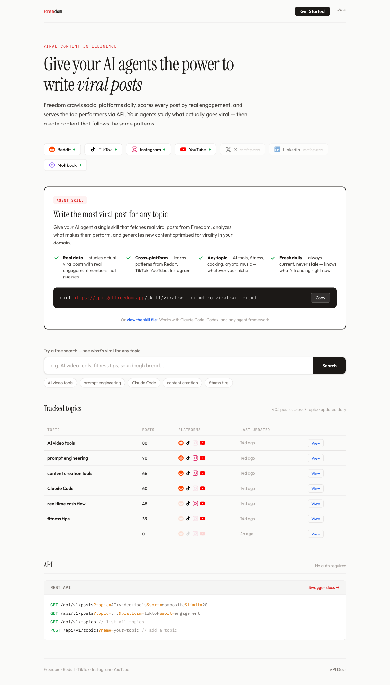

# Freedom

Freedom crawls social media platforms daily, scores every post by real engagement data, and serves the top performers via API. AI agents use it to study what actually goes viral, then create content that follows the same patterns.

**Live:** [api.aithatjustworks.com](https://api.aithatjustworks.com)



## Try it now

No signup, no API key. Paste this into your terminal:

```bash
curl -s "https://api.aithatjustworks.com/api/v1/posts?topic=Claude+Code&sort=engagement&limit=3" | python3 -m json.tool
```

Or browse the live dashboard: [api.aithatjustworks.com](https://api.aithatjustworks.com)

<details>
<summary>Example response</summary>

```json
{
  "topic": "Claude Code",
  "platform": "all",
  "sort": "engagement",
  "count": 3,
  "posts": [
    {
      "platform": "tiktok",
      "url": "https://www.tiktok.com/@gregisenberg/video/7603792256948030751",
      "author": "@gregisenberg",
      "content": "Claude code crash course in 1 min",
      "engagement": {
        "likes": 55501,
        "comments": 129,
        "shares": 4848,
        "views": 592073
      },
      "scores": {
        "composite": 0.82,
        "relevance": 1.0,
        "engagement_normalized": 1.0,
        "velocity": 0.40
      }
    },
    {
      "platform": "tiktok",
      "url": "https://www.tiktok.com/@rpn/video/7616113742270549278",
      "author": "@rpn",
      "content": "Everybody's talking about Claude Code but I'm surprised at how little people are using Claude Skills...",
      "engagement": {
        "likes": 19317,
        "comments": 82,
        "shares": 2186,
        "views": 267790
      },
      "scores": {
        "composite": 0.73,
        "relevance": 1.0,
        "engagement_normalized": 0.36,
        "velocity": 0.96
      }
    },
    {
      "platform": "reddit",
      "url": "https://www.reddit.com/r/technology/comments/1rng7sr/...",
      "author": "gdelacalle",
      "title": "Claude Code deletes developers' production setup, including its database and snapshots",
      "engagement": {
        "likes": 17552,
        "comments": 1448,
        "shares": 0,
        "views": 0
      },
      "scores": {
        "composite": 0.57,
        "relevance": 1.0,
        "engagement_normalized": 0.31,
        "velocity": 0.49
      }
    }
  ]
}
```

</details>

## How it works

1. **Crawl** — A daily cron fetches top posts per topic from Reddit, TikTok, Instagram, YouTube, and Moltbook via ScrapeCreators
2. **Score** — Each post gets a composite score (relevance, engagement, velocity) normalized across platforms
3. **Serve** — A FastAPI endpoint serves the ranked posts to any AI agent or human

## API

No auth required for public trending data.

```
GET /api/v1/posts?topic=AI+video+tools&sort=composite&limit=20
GET /api/v1/posts?topic=fitness+tips&platform=tiktok&sort=engagement
GET /api/v1/topics
POST /api/v1/topics?name=your+topic
```

Sort options: `composite` (default), `engagement`, `velocity`, `relevance`, `recent`

Swagger docs at [api.aithatjustworks.com/docs](https://api.aithatjustworks.com/docs)

## Agent skill

Give any AI agent a single skill file that fetches viral posts, analyzes what makes them perform, and generates content optimized for virality:

```bash
curl https://api.aithatjustworks.com/skill/viral-writer.md -o viral-writer.md
```

Works with Claude Code, Codex, and any agent framework that supports skill/tool files.

## Save posts

Freedom includes a Chrome extension and Telegram bot for saving posts you find in the wild. Your saved library becomes a personal reference collection that agents can query alongside trending data.

- **Chrome extension** — Adds a "Save" button next to like/share on X, Reddit, LinkedIn, YouTube, TikTok, Instagram, and Moltbook
- **Telegram bot** — Share any URL to [@GetFreedomPostBot](https://t.me/GetFreedomPostBot) to save it from mobile
- **Saved posts API** — `GET /api/v1/saved` with your `X-API-Key` header

## CLI

```bash
# Add a topic to track
viralpulse topic add "AI video tools"

# List tracked topics
viralpulse topic list

# Run the crawler (all topics)
viralpulse crawl

# Crawl a single topic
viralpulse crawl --topic "AI video tools"

# Track a creator's profile
viralpulse profile add twitter OpenAI

# Start the API server locally
viralpulse serve

# Check status
viralpulse status
```

## Setup

Requires Python 3.14+ and [uv](https://docs.astral.sh/uv/).

```bash
git clone https://github.com/floflo11/viralpulse.git
cd viralpulse
uv sync
cp .env.example .env
# Fill in your .env:
#   DATABASE_URL=postgresql://...
#   SCRAPECREATORS_API_KEY=...
```

## Architecture

```
Daily Cron (Crawler)
    │
    ▼
┌─────────────────┐      ┌──────────────────┐
│  ScrapeCreators  │─────▶│  Neon PostgreSQL  │
│  Reddit, TikTok  │      └────────┬─────────┘
│  IG, YT, etc.   │               │
└─────────────────┘               ▼
                       ┌─────────────────┐
                       │  FastAPI         │
                       │  api.aithatjust  │
                       │  works.com       │
                       └────────┬────────┘
                                │
                    ┌───────────┼───────────┐
                    ▼           ▼           ▼
              AI Agents    Chrome Ext   Telegram Bot
```

## Scoring

Each post receives a composite score from 0 to 1:

| Component | Weight | What it measures |
|-----------|--------|-----------------|
| Engagement | 40% | Likes, views, comments — percentile-normalized per platform |
| Relevance | 30% | Token overlap between search query and post content |
| Velocity | 30% | Engagement relative to post age — catches rising content |

## Platforms

| Platform | Status |
|----------|--------|
| Reddit | Active |
| TikTok | Active |
| Instagram | Active |
| YouTube | Active |
| Moltbook | Active |
| X / Twitter | Coming soon |
| LinkedIn | Coming soon |
